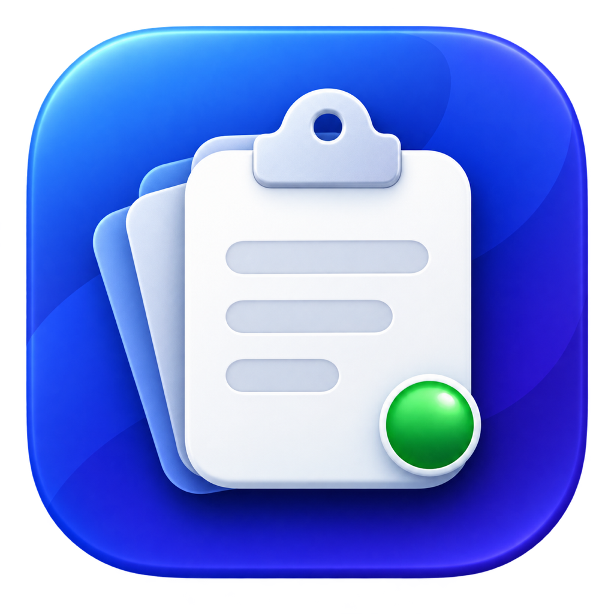
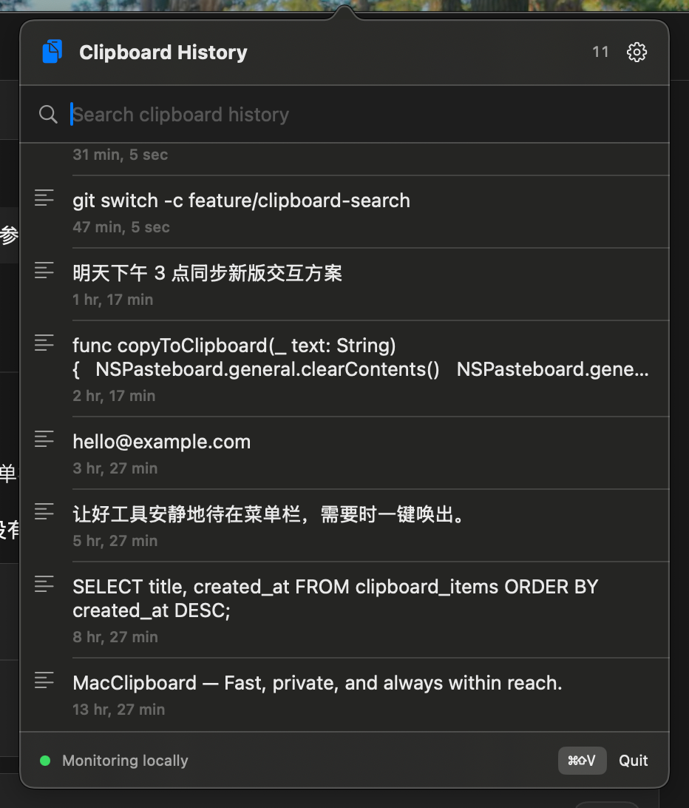

# Mac Clipboard

<p align="center">
  
</p>

一个轻量、私密、在本机运行的 macOS 菜单栏剪贴板历史工具。

它会记录你复制过的纯文本，通过菜单栏或全局快捷键快速搜索并再次复制。当前版本没有账号、云同步、遥测或网络请求。

<p align="center">
  
</p>

## 功能

- 自动监听 macOS 系统剪贴板中的纯文本和图片（PNG/TIFF，例如截图或浏览器中复制的图片；单张超过 20 MB 时跳过）。
- 点击菜单栏剪贴板图标或使用全局快捷键打开历史，默认快捷键为 `⌘⇧V`。
- 支持在设置中录制自定义全局快捷键，修改后立即生效。
- 支持点击搜索框筛选、点击复制和上下键切换候选项；当前选中项会展开显示更多正文，面板打开时不会成为 Key Window，也不会移动原输入焦点。
- 历史记录和收藏夹使用两个 Tab；右键可收藏或取消收藏，左右键可切换 Tab。
- 图片条目显示缩略图，选中时展开大图预览；再次复制会还原为剪贴板图片。
- 打开面板前会记住原应用的可编辑输入光标；按回车复制当前候选项并恢复该光标，然后自动粘贴。
- 自动去重；重复内容（文本按内容、图片按数据指纹）会移动到列表顶部。
- 支持单条删除、全部清空和暂停监听。
- 历史上限可设置为 25、50、100、200 或 500 条。
- 仅在本机保存历史：文本存于 JSON 文件，图片以 PNG 文件保存在同目录的 `images/` 子目录。

当前版本暂不记录文件、富文本或 HTML。

## 系统要求

- macOS 13 或更高版本
- Apple Command Line Tools
- Swift 6

使用脚本构建不需要安装完整 Xcode。

## 快速开始

从源码直接运行：

```bash
./Scripts/run.sh
```

启动后应用只出现在菜单栏，不会显示 Dock 图标。复制一段文本，再点击菜单栏图标或按默认快捷键 `⌘⇧V` 查看历史。

## 构建本地应用

```bash
./Scripts/build-app.sh
open dist/MacClipboard.app
```

构建结果位于：

```text
dist/MacClipboard.app
```

脚本执行 Swift Release 构建，组装标准 macOS app bundle，并使用 ad-hoc 签名供本机运行。`dist/` 和 `.build/` 已被 Git 忽略，不会提交到仓库。

如果 macOS 首次打开时阻止应用，可在“系统设置 → 隐私与安全性”中确认打开。

“回车后自动粘贴”需要 macOS 辅助功能权限。首次使用时系统会提示授权；不授权时回车仍会把内容复制到剪贴板，只是不自动填入原应用。

开发脚本使用 ad-hoc 签名；重新构建会改变代码身份并令旧的辅助功能授权失效。完成构建后，需要在“系统设置 → 隐私与安全性 → 辅助功能”中删除旧条目并重新添加当前 `dist/MacClipboard.app`。正式开发者签名不会有这个反复授权问题。

## 使用方法

1. 启动 MacClipboard。
2. 在任意应用中复制文本。
3. 按全局快捷键（默认 `⌘⇧V`）或点击菜单栏剪贴板图标。
4. 输入关键词筛选历史。
5. 按上下键移动候选项，按回车复制并填入原应用的输入光标；也可以直接点击某一条，仅复制到剪贴板。

面板设置中可以查看或请求辅助功能权限、录制新的全局快捷键、恢复默认快捷键、调整历史数量、暂停监听或清空全部历史。

## 架构概览

```text
NSPasteboard
    ↓ changeCount polling
ClipboardStore
    ├── ClipboardHistoryRules → 去重、排序、数量限制
    ├── HistoryPersistence    → 本地 JSON
    └── SwiftUI Views         → 搜索、复制、删除、设置

StatusBarController → NSStatusItem + 不成为 Key Window 的 NSPanel
GlobalHotKey        → 可持久化、运行时重新注册的全局快捷键
PanelCommandRouter  → 面板显示期间用临时热键处理上下、回车和 Esc
FocusedInputPaster  → 回车时等待原应用回到前台并发送一次 ⌘V
```

Swift Package 包含三个 target：

| Target | 职责 |
| --- | --- |
| `MacClipboardCore` | 不依赖 UI 的数据模型和历史规则 |
| `MacClipboard` | SwiftUI/AppKit 菜单栏应用 |
| `MacClipboardSelfTests` | 无需 XCTest 的核心逻辑自检 |

更详细的目录结构、维护约束和验证清单见 [AGENTS.md](AGENTS.md)。

## 自检与开发验证

运行核心逻辑自检：

```bash
./Scripts/self-test.sh
```

当前自检覆盖：

- 新内容插入顶部和历史数量限制。
- 重复内容去重并保留稳定 ID。
- 忽略空白剪贴板内容。
- 候选项上下移动、初始选择和边界选择。

完整验证：

```bash
./Scripts/self-test.sh
./Scripts/build-app.sh
plutil -lint Resources/Info.plist
codesign --verify --deep --strict dist/MacClipboard.app
```

## 本地数据与隐私

历史文件位于：

```text
~/Library/Application Support/MacClipboard/history.json
```

收藏夹单独保存在同一目录的 `favorites.json`，清空普通历史不会删除收藏内容。图片以 PNG 文件保存在同目录的 `images/` 子目录，删除条目或超出历史上限时自动清理未引用的文件。

剪贴板管理器在运行期间能够读取复制的文本和图片。复制密码、Token 等敏感内容前，可以在设置中暂停监听；也可以随时清空历史。

MacClipboard 当前不会连接网络或上传数据。删除本地历史文件不会影响系统剪贴板。

辅助功能权限仅用于判断原应用的焦点是否为可编辑文本，以及向该应用发送一次 `⌘V`。MacClipboard 不会通过辅助功能接口读取或记录输入框正文。

## 项目结构

```text
Resources/                  App bundle 配置
Scripts/                    运行、自检和构建脚本
Sources/MacClipboardCore/   纯 Swift 核心规则
Sources/MacClipboard/       macOS 应用、服务和界面
Sources/MacClipboardSelfTests/  核心自检入口
Package.swift               SwiftPM 配置
```

## 已知限制

- 支持纯文本和 PNG/TIFF 图片；不支持文件、富文本或 HTML。
- 回车自动填入依赖目标应用正确提供 macOS 辅助功能文本属性；不支持时内容仍会保留在剪贴板中。
- 重新登录后不会自动启动，需要手动打开应用。
- 本地历史当前为明文 JSON 和 PNG 图片文件，请勿把历史数据提交或分享。
